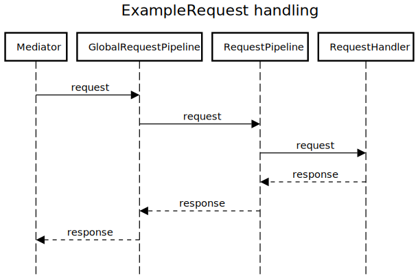

# Requests

They work in synchronous way returning response. Thus each request may only have one handler. They can be used to implement simple Use-case or CQRS patterns.

## Handlers

```ts
class ExampleRequest {}

@RequestHandler(ExampleRequest)
export class ExampleRequestHandler implements IRequestHandler<ExampleRequest, string> {
  async handle(request: ExampleRequest) {
    return 'ok';
  }
}
```

## Pipelines

A middleware for requests. They allow to execute some pre or post actions for given request handling.

In addition to request object itself a `handle` method receives `next` grip which wraps next pipeline call or handler itself. The returned value is the result of mentioned providers.

```ts
@RequestPipeline(ExampleRequest)
export class ExampleRequestPipeline implements IRequestPipeline<ExampleRequest, string> {
  async handle(request: ExampleRequest, next: () => Promise<string>) {
    console.log(`Starting to handle ${request.constructor.name}`);
    const result = await next();
    console.log(`Finished ${request.constructor.name} handling`);
    return result;
  }
}

// Pipelines unlike handlers can be attached to many requests types
@RequestPipeline(ExampleRequest, OtherExampleRequest)
export class ExampleRequestPipeline implements IRequestPipeline<IRequest, string> {
  ...
}
```

## Global pipelines

Similarly to events global handlers pipelines can be used globally eg. for caching.

```ts
@GlobalRequestPipeline()
export class ExampleGlobalRequestPipeline implements IGlobalRequestPipeline {
  async handle(request: ExampleRequest, next: () => Promise<unknown>) {
    console.log(`Accepting request ${request.constructor.name}`);
    const result = await next();
    console.log(`Responding to ${request.constructor.name}`);
    return result;
  }
}
```

## Usage

```ts
const mediator = MediatorFactory.create({
  providers: [GlobalRequestPipeline, RequestPipeline, RequestHandler],
  requestsTimeout: 1000, // Requests handling will be terminated after 1s with timeout exception
});

console.log(await mediator.request<string>(new ExampleRequest()));
// Output:
// Accepting request ExampleRequest
// Starting to handle ExampleRequest
// Finished ExampleRequest handling
// Responding to ExampleRequest
// ok
```

## Execution flow


